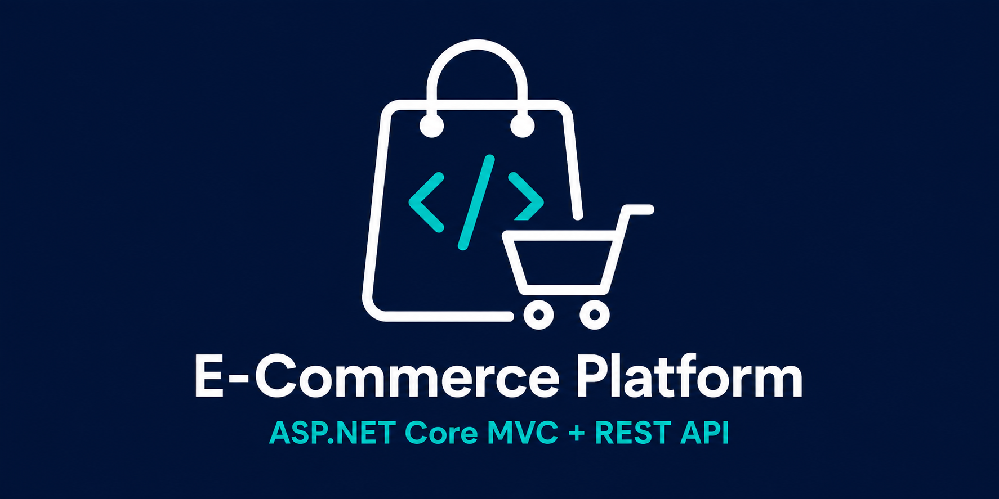

# E-Commerce Platform



An individual e-commerce project implemented in two .NET 9 applications: an ASP.NET Core MVC storefront and administration portal, and a RESTful ASP.NET Core Web API for client integrations.

## Projects

| Project | Description |
| --- | --- |
| `ECommerce522.Mvc` | Razor-based storefront, account flows, admin catalog management, cart, promotions, and Stripe Checkout initiation. |
| `ECommerce522.Api` | REST API for catalog, users, carts, checkout, orders, profiles, and authentication. Includes JWT access/refresh tokens and OpenAPI documentation through Scalar. |

Both applications use the same e-commerce domain and SQL Server schema through Entity Framework Core migrations.

## Main features

- Product, category, and brand management with image uploads
- Catalog filtering, pagination, product details, and related products
- ASP.NET Core Identity with role-based authorization for SuperAdmin, Admin, Employee, and Customer roles
- JWT access tokens and rotating refresh tokens in the API
- Email confirmation, OTP-based password recovery, profile updates, and password changes
- Persistent shopping cart, product discounts, and promotional codes
- Stripe Checkout integration and order/order-item persistence
- Checkout completion that transfers cart items to an order, updates inventory, clears the cart, and sends an email notification
- Administrative order filtering and shipment details
- Localized API messages in English, Arabic, and Spanish
- OpenAPI specification and interactive Scalar API documentation

## Architecture and technologies

- C#, .NET 9, ASP.NET Core MVC, Razor Views, and ASP.NET Core Web API
- Entity Framework Core, Code First migrations, and SQL Server
- ASP.NET Core Identity, JWT Bearer authentication, and role-based authorization
- Dependency Injection, Repository Pattern, DTOs, async/await, and Mapster
- Stripe.NET, SMTP email, OpenAPI, Scalar, Bootstrap, and JavaScript

## Repository structure

```text
E-Commerce-Platform/
|-- E-Commerce-Platform.sln
`-- src/
    |-- ECommerce522.Mvc/
    `-- ECommerce522.Api/
```

## Prerequisites

- .NET 9 SDK
- SQL Server or SQL Server Express
- Stripe test credentials for checkout
- SMTP credentials for account emails

## Local setup

1. Clone the repository and restore the solution:

   ```bash
   git clone https://github.com/3ab3al11/E-Commerce-Platform.git
   cd E-Commerce-Platform
   dotnet restore E-Commerce-Platform.sln
   ```

2. Configure the connection string for each application with User Secrets or environment variables:

   ```bash
   cd src/ECommerce522.Mvc
   dotnet user-secrets set "ConnectionStrings:DefaultConnection" "<your-sql-server-connection-string>"

   cd ../ECommerce522.Api
   dotnet user-secrets set "ConnectionStrings:DefaultConnection" "<your-sql-server-connection-string>"
   ```

3. Configure private values in each project that uses them:

   ```bash
   dotnet user-secrets set "Email:Username" "<smtp-username>"
   dotnet user-secrets set "Email:Password" "<smtp-password>"
   dotnet user-secrets set "Email:From" "<sender-email>"
   dotnet user-secrets set "Stripe:SecretKey" "<stripe-test-secret-key>"
   ```

4. Configure a JWT signing key in the API project. Use a randomly generated value of at least 32 characters:

   ```bash
   cd src/ECommerce522.Api
   dotnet user-secrets set "Jwt:Key" "<strong-random-signing-key>"
   ```

5. Optionally seed a SuperAdmin account in either project:

   ```bash
   dotnet user-secrets set "SeedAdmin:Email" "<admin-email>"
   dotnet user-secrets set "SeedAdmin:Password" "<strong-admin-password>"
   dotnet user-secrets set "SeedAdmin:UserName" "<admin-username>"
   ```

6. Run either application:

   ```bash
   dotnet run --project src/ECommerce522.Mvc/ECommerce522.csproj
   dotnet run --project src/ECommerce522.Api/ECommerce522.APIV9.csproj
   ```

Database migrations and application roles are applied during startup. The API launch profile opens Scalar at `/scalar` for endpoint discovery and testing.

## Security configuration

No SMTP password, Stripe secret, JWT signing key, or seeded administrator password is committed to this repository. Store private values with .NET User Secrets during development and use a managed secret store or environment variables in deployed environments.
